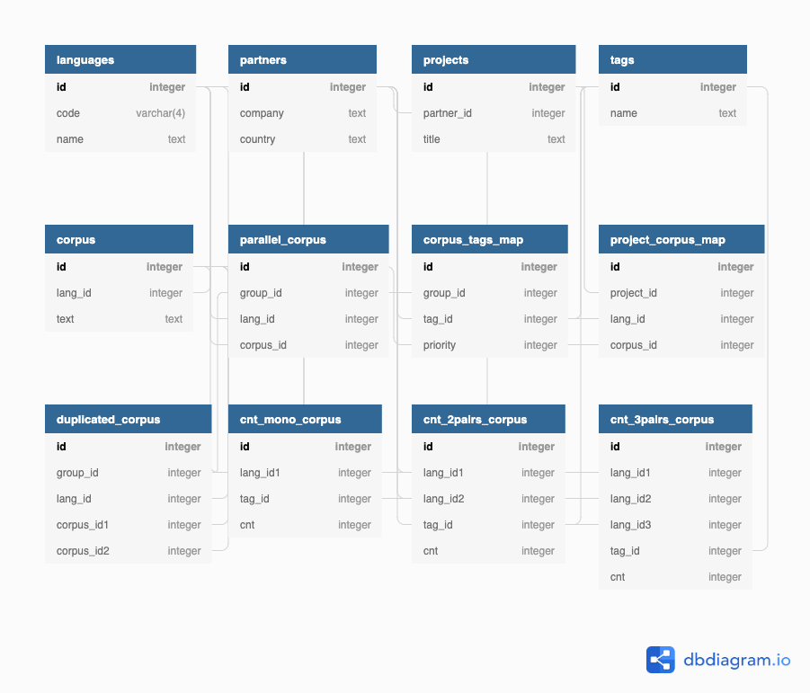

## Preface
`data_projects_professional_20_to_22` is a collection of scripts that I have developed myself or contributed heavily to. Some projects were not included due to information sensitivity. And certain scripts of the projects that are sensitive to the company's internal information were not disclosed. 

During my tenure, I was consistently involved in at least few projects, but due to the dynamic demands of our B2B Training Data Sales projects, there were also times when I was handling 3-5 different projects. This multifaceted workload occasionally led to variances in development practices. My mentorship under my direct supervisor, the co-Founder / CDO was instrumental in my professional growth. He was a steadfast advocate for continuous learning and always encouraged me to learn and improve my development skills, especially with the conjunction of Python and bash/shell scripting, which I am so grateful for. 

He strategically allocated opportunities for me to refine these competencies during less intensive periods, ensuring a balance between skill development and project execution. In times of heightened demand, however, he prioritized efficiency and endorsed my Python-centric approach to expedite deliverables and adhere to project timelines. Given the lean composition of our Data Team, which comprised only the two of us, this approach was essential for optimizing our output without compromising quality.

Right after I returned to Emory, due to the numerous amounts of B2B projects, the company was able to have its first ever quarter where they successfully turned to profit with $3.4M in sales and $750K in operating income since its inception ('22 2Q). 

Along with the B2B team and the CDO, I am proud and grateful to have been a part of this accomplishment.

## Projects
Note that this is a translation of the original `README.md` file, and some of the content may be outdated and not in sync with the code itself. 

Although not all the projects and folders have `.md` files, some do, which explains each project flow further.

Also, 
Please only interpret this as a general guideline.

### apps/b2b_projects

Extract and process data according to the characteristics of each B2B project.

### apps/bot

Corpus-related slack bot for internal usage.
- Supported functions:
  - Count of parallel corpora
  - Extract samples from parallel corpora
    - Language pairs / count / domain / more than a certain character or word count
    - Output formats:
      - xlsx, csv, tmx

### apps/texts/check_quality

Check corpus quality
- Items:
  - Confirm if it is a string
  - Check the number of brackets ('(', ')') and double quotation marks ('"') for right pairing
  - Check for incorrect characters ('%s', '%d', etc.)
  - Check for a minimum number of words or characters
  - Check for similar sentences (Levenshtein algorithm, less than 10)
  - Check for the presence of a verb
  - Check if there is more than one sentence
  - Check for the inclusion of swear words, sexual words, etc.
  - Check if it matches the corpora owned by the company
- Output files:
  - bad: Corresponds to one or more of the above filters
  - not_bad: Does not correspond to the above filters

### apps/texts/manipulate_excel

- Supported functions:
  - Merge and split files
  - Machine translation (Google / Youdao)
  - Extract only rows where a specific column is null or not null
  - Extract only rows that include or do not include a specific keyword
  - Extract only rows that contain Korean
  - Extract only rows with more than a minimum number of words or fewer than a maximum number of words
  - Extract only rows with more than a minimum number of characters or fewer than a maximum number of characters
  - Delete rows in one file that overlap with another file (A - B)
  - Check English grammar (GrammarBot: https://www.grammarbot.io)
  - File format conversion (xlsx, csv -> xlsx, csv, tmx)
- Output formats:
  - xlsx, csv, tmx
  
### apps/texts/preview

- Supported functions:
  - Preview Excel files
  - View the number of columns in Excel files located in a specific path
  
### apps/texts/refine_cms

Change or delete parallel corpora in DB and ES.

### apps/db/count_corpus

Update the count of parallel corpora owned in the DB statistics table.

### apps/db/db_to_excel

Extract parallel corpora that meet conditions from DB.
- Language
  - At least one or more
- Selectable options:
  - More than a certain number of characters
  - More than a certain number of words
  - Categorized by domain / Not categorized by domain / Specific domain
  - Exclude parallel corpora supplied to a specific company
  - Parallel corpora not translated into a specific language (e.g., parallel corpora in English-Korean without Japanese translation)
- Columns that can be added to the output file:
  - ID (Group ID, Corpus ID), Number of characters, Number of words, Domain, Source (supplying company)
- Output formats:
  - xlsx, csv, tmx

### apps/db/excel_to_db

Read parallel corpora from an Excel file and save it to the DB.

- Check if Corpus 1 and Corpus 2 exist in ElasticSearch (if checking directly from the DB, it takes a lot of time to compare strings, and processing is almost impossible).
- Branch processing depending on the existence:
  - If Corpus 1 exists but Corpus 2 does not, register Corpus 2 in the corpus and register it in the parallel_corpus with the group_id of Corpus 1.
  - If Corpus 2 exists but Corpus 1 does not, process the opposite.
  - If both Corpus 1 and Corpus 2 do not exist, register each in the corpus and also register in the parallel_corpus with the same group_id.
- If there is a completed project, register it in the project_corpus_map.

### apps/up_tag_from_xlsx

Read an Excel file categorized by domain and update the domain in the DB based on the group ID.

### apps/images

Statistics and data extraction related to images (translation requests, QR Places).

### apps/images/annotations

Integrate with Google Vision API to box text in images and extract text.

### apps/speeches

Statistics and data extraction for projects related to voice data.

### apps/utils

Various libraries for DataFrame processing, file saving, machine translation, etc.

## DB Schema

Tool used: [dbdiagram](https://dbdiagram.io)

