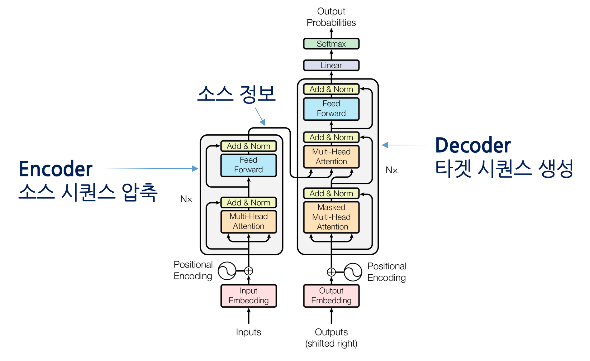

# NMT Resources

**Collection of resources and documentations for NMT! (Neural Machine Translation)**

- **[Explore the docs](https://github.com/flitto/data_mgmt/tree/feat/2022-HF-01/readme_resources)**
- [Scripts](https://github.com/flitto/data_mgmt/tree/feat/2022-HF-01/apps/b2b_projects/2022-HF-01)
- [Suggest Resources](https://github.com/flitto/data_mgmt/issues)

## Table of contents
1. [About The Project](#about-the-project)
   - [Built With](#built-with)
2. [Resources](#resources)
3. [To Explore Further](#to-explore-further)

## About The Project

The importance of a Machine Translation (MT) program has been increasing in parallel with the industry's demand for multilingual corpus datasets.

Here's why:
- Quality of MT can't be as good as Human Translation (HT).
  - but it can do the groundwork to speed up the process of the project through MTPE (Post Edit).
- We can also use it to check the general quality of a developed dataset.
  - check the similarity between the finished destination language vs MT of the source
    - too low? then maybe the translation might be completely wrong -> able to check for human errors quicker
    - too high? some clients don't want a new dataset that is too similar to MT output.
- As well as our own, we currently have access to many APIs
  - but with the accumulated data through many projects, we wanted to test out using our own data to finetune models distributed on Hugging Face

Below I have listed a few resources that I referred to get myself started.

### Built With

Here are the major frameworks/libraries used to bootstrap your project.

- [Python](https://www.python.org/)
- [Pandas](https://pandas.pydata.org/)
- [Numpy](https://numpy.org/)
- [PyArrow](https://arrow.apache.org/docs/python/index.html)
- [PyTorch](https://pytorch.org/)
- [Hugging Face Models](https://huggingface.co/)
  - [Transformers](https://huggingface.co/transformers/v3.0.2/index.html)
    - [MarianMT](https://huggingface.co/docs/transformers/model_doc/marian)
    - [mBART and mBART-50](https://huggingface.co/docs/transformers/model_doc/mbart) (to be explored more..)

## Resources

Here are the books, Medium (Towards Data Science) posts, and tutorials utilized to start finetuning models.

1. [Do it! BERT와 GPT로 배우는 자연어 처리](https://ratsgo.github.io/nlpbook/) (Book)
2. [딥 러닝을 이용한 자연어 처리 입문](https://wikidocs.net/book/2155) (Book)
3. [Basics of Tokenization](https://medium.com/data-science-in-your-pocket/tokenization-algorithms-in-natural-language-processing-nlp-1fceab8454af) (Medium)
4. [Epochs vs Iterations vs batch size](https://towardsdatascience.com/epoch-vs-iterations-vs-batch-size-4dfb9c7ce9c9) (Medium)
5. [Basics of Seq2Seq](https://medium.com/analytics-vidhya/seq2seq-models-french-to-english-translation-using-encoder-decoder-model-with-attention-9c05b2c09af8) (Medium)
6. [Fine Tuning MarianMT Model](https://medium.com/@tskumar1320/how-to-fine-tune-pre-trained-language-translation-model-3e8a6aace9f) (Medium)

## To Explore Further

1. mBART-50 Fine Tuning a Multilingual Model
   - [part 1](https://towardsdatascience.com/massive-pretraining-for-bilingual-machine-translation-3e26bfd85432)
   - [part 2](https://towardsdatascience.com/mbart50-multilingual-fine-tuning-of-extensible-multilingual-pretraining-70a7305d4838)
2. [2018 Fall CMU Deep Learning course](https://www.cs.cmu.edu/~bhiksha/courses/deeplearning/Fall.2018/www/)

[Back to top](#top)